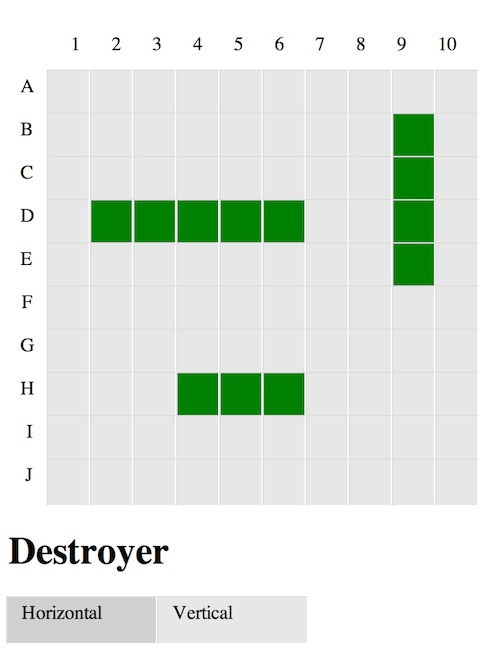

# Classic Battleship Game implementation as a Web App in Sinatra
> Session support of multiple pairs of players

## Add ships to the board

## Play the Battleship Game with a player on the other end of the wire

## Things yet to implement:
* Display a win and lose message to a winner and loser respectively
* Display error pages when players place ships outside of the grid (and other errors)
* Rewrite the whole thin in JS instead of fixing these bugs
